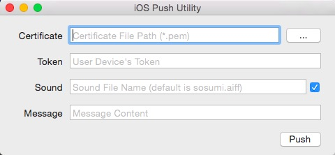

[中文](doc/README_zh.md)

# iOSPushUtility
Pushing test utility for iOS. `iOSPushUtility` dependent [Houston](https://github.com/nomad/Houston). If you want test pushing without server host, then you came hear right!

# Feature
* The easiest way to send push.
* Pushing test without server host.
* Custom sound file.
* Remember last input.

# Usage
1. Select certificate file(*.pem).
2. Enter users' devices' token.
3. Enter sound file name. (Optional)
4. Enter message.
5. Click Push button.

# Note⚠
* If you haven't installed [Houston](https://github.com/nomad/Houston) on your machine, `iOSPushUtility` will show `Install HOUSTON` button, click to install `HOUSTON`.
* The `Token` is get from `application:didRegisterForRemoteNotificationsWithDeviceToken:`, transform the `NSData` to `hex char`.( [0x01,0x02,0x0A,0x0B] => "01020A0B" )

# Snapshot

# Icon
* Icon design by `何岸`